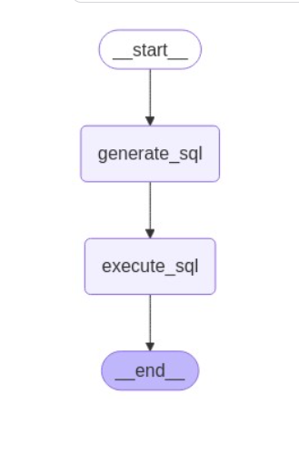

# Gemini-Powered SQL Query Generator & Executor

## Overview
This project is a **PostgreSQL Agent** powered by **Google's Gemini API** and **LangGraph**, which automatically converts natural language questions into SQL queries, executes them on a PostgreSQL database, and returns the results. The application is built using **Streamlit** for the user interface.

## Features
- **Natural Language to SQL Conversion**: Uses Google's Gemini API to generate SQL queries from user input.
- **Automated Query Execution**: Executes generated SQL queries on a PostgreSQL database.
- **LangGraph Workflow**: Implements a state graph to define execution flow.
- **Interactive Streamlit UI**: Allows users to input questions, view generated SQL, and see execution results.
- **Error Handling**: Displays errors if queries fail due to syntax or database issues.
- **Graph Visualization**: Generates LangGraph visualization in the sidebar.

## Technologies Used
- **Streamlit** - UI for interaction
- **Google Gemini API** - Natural Language Processing
- **PostgreSQL** - Database backend
- **LangGraph** - Workflow automation
- **Python (psycopg2, dotenv, typing_extensions)** - Backend logic

  ### **Workflow Diagram**

## Installation & Setup

### Prerequisites
Ensure you have:
- **Python 3.8+** installed
- **PostgreSQL** database set up
- **Google Gemini API Key**

## ⚙️ **Environment Setup**

### **.env File Configuration**
- **GOOGLE_API_KEY**=your_google_api_key
- **DB_NAME**=your_db_name
- **DB_USER**=your_db_user
- **DB_PASSWORD**=your_db_password
- **DB_HOST**=your_db_host
- **DB_PORT**=your_db_port
## Run the Application
streamlit run app.py
